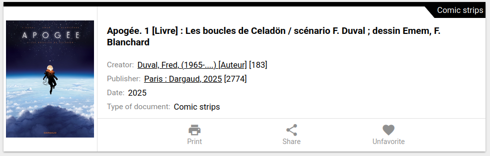
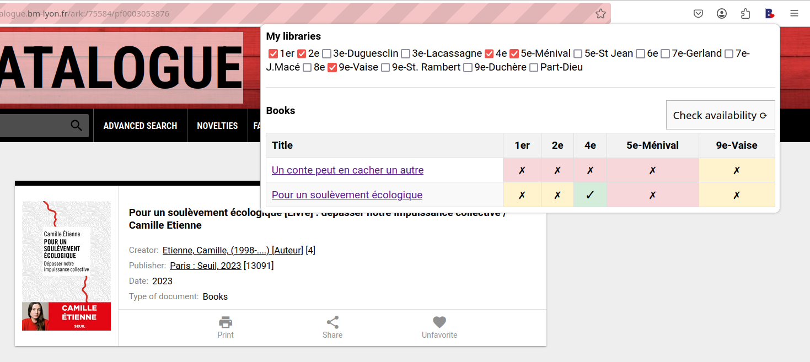

# BM Lyon reading list

The addon manages a reading list and checks current availability in your public library.
It only works for Lyon public library and its website https://catalogue.bm-lyon.fr/ .

The code is split in two parts.

## Content script

The content script (`content.js`) adds a "favorite" button to the library website on individual items.

New button next to "Print" and "Share".

It is based on the current UI (2025/03/03) and may break if the page changes.
Favorites are saved in local storage as a simple list.

## Popup script

The popup script is activated by clicking the plugin icon in the menu bar.
This script displays all the saved items and checks their availability.

It is calling the library's API and specifically the `notice` endpoint.
Once again this has been reverse engineered and is subject to potential breaks.
